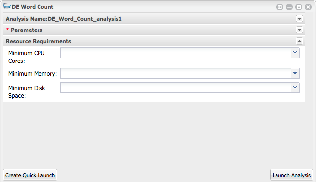
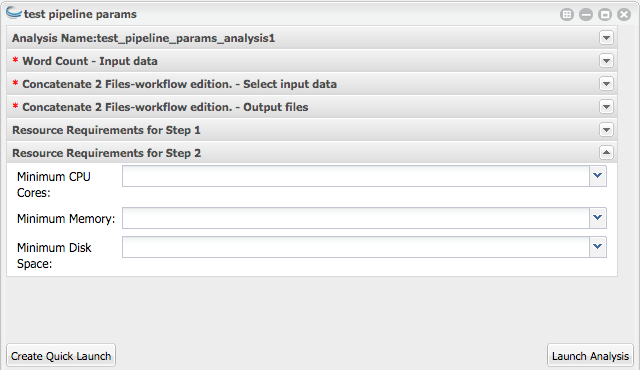
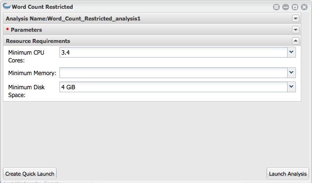

> \<a href=\"<https://atmo.cyverse.org>\"
> target=\"blank\"\>Atmosphere\</a>

> \<a
> href=\"<https://wiki.cyverse.org/wiki/display/atmman/Atmosphere+Manual+Table+of+Contents>\"
> target=\"blank\"\>Atmosphere Manual\</a>

> \<a
> href=\"<https://learning.cyverse.org/projects/atmosphere-guide/en/latest/>\"
> target=\"blank\"\>Atmosphere Guide\</a>

> \<a href=\"<https://bisque.cyverse.org/client_service/>\"
> target=\"blank\"\>BisQue\</a>

> \<a href=\"<https://wiki.cyverse.org/wiki/display/BIS>\"
> target=\"blank\"\>BisQue Manual\</a>

> \<a href=\"<https://user.cyverse.org/>\" target=\"\_blank\"\>CyVerse
> User Portal\</a>

> \<a href=\"<http://learning.cyverse.org>\" target=\"blank\"\>CyVerse
> Learning Center\</a>

> \<a href=\"<https://wiki.cyverse.org>\" target=\"blank\"\>CyVerse
> Wiki\</a>

> \<a href=\"<http://www.cyverse.org/data-store>\"
> target=\"\_blank\"\>Data Store\</a>

> \<a
> href=\"<https://wiki.cyverse.org/wiki/display/DS/Data+Store+Table+of+Contents>\"
> target=\"blank\"\>Data Store Manual\</a>

> \<a
> href=\"<https://learning.cyverse.org/projects/data_store_guide/en/latest/>\"
> target=\"blank\"\>Data Store Guide\</a>

> \<a href=\"<https://de.cyverse.org/de/>\" target=\"blank\"\>Discovery
> Environment\</a>

> \<a
> href=\"<https://wiki.cyverse.org/wiki/display/DEmanual/Table+of+Contents>\"
> target=\"blank\"\>DE Manual\</a>

> \<a
> href=\"<http://learning.cyverse.org/projects/cyverse-discovery-environment-guide/>\"
> target=\"blank\"\>Discovery Environment Guide\</a>

> \<a href=\"<https://dnasubway.cyverse.org/>\" target=\"blank\"\>DNA
> Subway\</a>

> \<a
> href=\"<https://learning.cyverse.org/projects/dnasubway_guide/en/latest/>\"
> target=\"blank\"\>DNA Subway Manual\</a>

> \<a
> href=\"<https://learning.cyverse.org/projects/dnasubway_guide/en/latest/>\"
> target=\"blank\"\>DNA Subway Guide\</a>

> \<a href=\"<https://www.sciapps.org/>\" target=\"blank\"\>SciApps\</a>

> \<a
> href=\"<https://learning.cyverse.org/projects/sciapps_guide/en/latest/>\"
> target=\"blank\"\>SciApps Manual\</a>

> \<a
> href=\"<https://learning.cyverse.org/projects/sciapps_guide/en/latest/>\"
> target=\"blank\"\>SciApps Guide\</a>

> \<a href=\"<https://cyverse-de.github.io/api/>\"
> target=\"blank\"\>Terrain DE API Docs\</a>

> \<a href=\"<https://www.tacc.utexas.edu/tapis>\"
> target=\"blank\"\>Tapis TACC API\</a>

> \<a href=\"<http://ask.iplantcollaborative.org/questions>\"
> target=\"blank\"\>Ask CyVerse\</a>

> \<a href=\"<http://learning.cyverse.org/en/latest/>\"
> target=\"blank\"\>Agave Guide\</a>

> \<a href=\"<http://developer.agaveapi.co/#introduction>\"
> target=\"blank\"\>Agave API\</a>

> \<a href=\"<https://agaveapi.co>\" target=\"blank\"\>Agave Live
> Docs\</a>

> \<a href=\"<http://learning.cyverse.org/en/latest/>\"
> target=\"blank\"\>BisQue Guide\</a>

> \<a
> href=\"<https://learning.cyverse.org/en/latest/quick_starts.html>\"
> target=\"blank\"\>Quick Starts\</a>

> \<a
> href=\"<https://learning.cyverse.org/en/latest/tools_and_apps.html>\"
> target=\"blank\"\>Tool and App Integration Guide\</a>

> \<a href=\"<https://learning.cyverse.org/en/latest/tutorials.html>\"
> target=\"blank\"\>Tutorials\</a>

\_

{width="15px" height="15px"}\_ [Learning
Center Home](http://learning.cyverse.org/)

# Analysis Resource Requests

In an App Launch dialog, \"Resource Requirement\" panels will always be
appended as the last step in the dialog, after the analysis name,
details, and parameter group panels defined by that app.

If required, the user may adjust these minimum resource requirements so
that the analysis may be submitted with requests for larger minimum
resources. Note that this may cause those analyses to wait longer in the
submission queue until a node that matches those minimum requirements
becomes available. So generally users may wish to leave the resource
requests set to the defaults that the tool or app integrator has set.

------------------------------------------------------------------------

**Single Step Apps**

If there is only 1 step in the analysis, then one \"Resource
Requirements\" panel will be appended to the App Launch dialog.
{width="475px"
height="275px"}

**Workflows**

If there is more than 1 step in the analysis, then each step in the
workflow will append its own \"Resource Requirements\" panel.
{width="475px"
height="275px"}

**Resource Limits**

The drop-downs for each requirement are populated with the same values
available to tool integrators in the DE\'s add/edit private tool dialog.

-   0,1,2,4,8 minimum CPU
-   0,2,4,8,16 GiB minimum memory
-   0,1,2,4,8, and doubling each additional step up to 512GiB minimum
    disk space

If a step defines minimum CPU, RAM, or disk requirements, those values
will be populated by default in that step\'s \"Resource Requirements\"
panel. Additionally, min and max values set for these resources are used
to limit which options are available in that resource\'s drop-down.

For example, the following tool has 3.4 min CPU, 4GiB max memory, and
4GiB min disk space defined. So the \"Resource Requirements\" panel in
the launch dialog for an app using this tool will set 3.4 min CPU cores
and 4GiB min disk space by default.
{width="475px"
height="278px"}

Additionally, if the user wishes to adjust the minimum CPU requirements,
then only the options 0, 4, and 8 will be available. Similarly for
memory, only 0, 2, and 4GiB options will be available; and for disk, the
options for 1 and 2 GiB will not be available (since those are below the
4GiB minimum defined by the tool).

Selecting a \'0\' in any of these drop-downs has the effect of
requesting no requirement for that resource in the analysis submission.

**VICE Limits**

As another example, our internal docs for creating VICE tools used to
instruct admins to use 0.1 min CPUs, 2 max CPUs, and 4,000,000,000 max
memory. So the \"Resource Requirements\" panel for the following
\"jupyter-lab\" app will use 0.1 min CPUs by default, and limit the CPU
options to 0, 1, or 2 CPUs. Minimum memory will not be auto-filled by
default, but will be limited to only 0 or 2GiB for the user, since the
4,000,000,000 max memory limit is just less than the next 4GiB option.
{width="475px"
height="275px"}

------------------------------------------------------------------------

**Fix or improve this documentation**

-   Search for an answer:
-   Ask us for help: click on the lower right-hand side of the page
-   Report an issue or submit a change:
-   Send feedback: [Tutorials\@CyVerse.org](Tutorials@CyVerse.org)

------------------------------------------------------------------------
