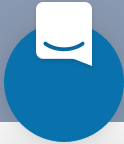

.. include:: cyverse_rst_defined_substitutions.txt
.. include:: custom_urls.txt

|CyVerse_logo|_
|Home_Icon|_
`Learning Center Home <http://learning.cyverse.org/>`_

Logging into the Discovery Environment (DE)
-------------------------------------------

When you first arrive at the |Discovery Environment|, you'll see the Dashboard. The Dashboard contains links to news, CyVerse videos, and a list of recently added public apps you can use. The left sidebar shows icons for accessing Data, Apps, Analyses, Teams, and Help.

We welcome you to freely explore the Dashboard, but to perform any tasks, you must have an account and be logged in. You may log in by clicking the profile icon in the upper right-hand corner of the DE, or by clicking `SIGN IN` when you
encounter a message to login. If you don't have an account yet or you've forgotten your password, you can visit the |CyVerse User Portal|
to create an account or reset your password.

-----

*About the Dashboard*
~~~~~~~~~~~~~~~~~~~~~~~~~~~~~~~~~~~~~~~~~~~~

The Dashboard provides an overview of recent activity in CyVerse and the
Discovery Environment. Your recently launched analyses, newly integrated apps
that you've been working on, and other activity will show on the Dashboard, as
well as CyVerse-related news and events, video tutorials, and newly released
public apps.

|de_dashboard|

*Logging in*
~~~~~~~~~~~~~~~~~~~~~~~~~~~~~~~~~~~~~~~~~~~~

1. To log in from the Dashboard, navigate to the |Discovery Environment| and
click the |profile icon| (profile icon) in the upper right corner of the DE.

.. Tip::
   If you forgot your password, you can reset it at the |CyVerse User Portal|.

2. After logging in with your username and password, you'll be returned to the
previous view. For example, if you were on the Apps view when you clicked `SIGN
IN[d]`, you'll return to that view.

You can take a short tour of the DE's main features by clicking the |help_icon| (help icon) in the left sidebar and selecting "Product Tour".

----

**Fix or improve this documentation**

- Search for an answer:
   |CyVerse Learning Center|
- Ask us for help:
  click |Intercom| on the lower right-hand side of the page
- Report an issue or submit a change:
  |Github Repo Link|
- Send feedback: `Tutorials@CyVerse.org <Tutorials@CyVerse.org>`_

----

  |Home_Icon|_
  `Learning Center Home <http://learning.cyverse.org/>`_

.. |CyVerse logo| image:: ./img/cyverse_rgb.png
    :width: 500
    :height: 100
.. _CyVerse logo: http://learning.cyverse.org/
.. |Home_Icon| image:: ./img/homeicon.png
    :width: 25
    :height: 25
.. _Home_Icon: http://learning.cyverse.org/

.. |discovery environment| raw:: html

    <a href="https://de.cyverse.org/de/" target="_blank">https://de.cyverse.org/de/</a>
