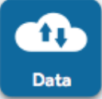
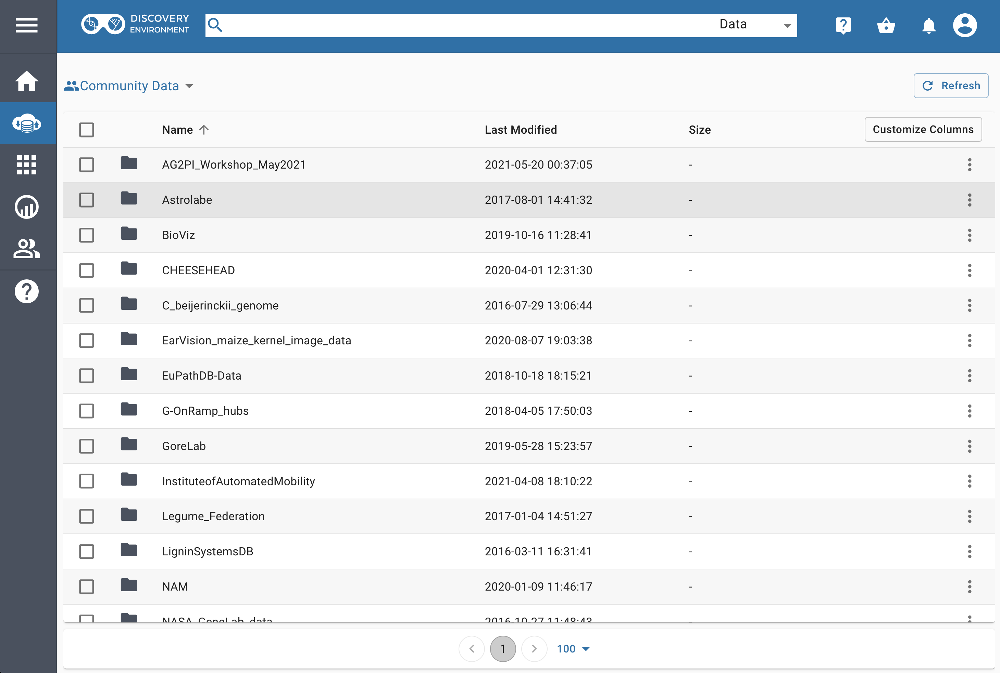
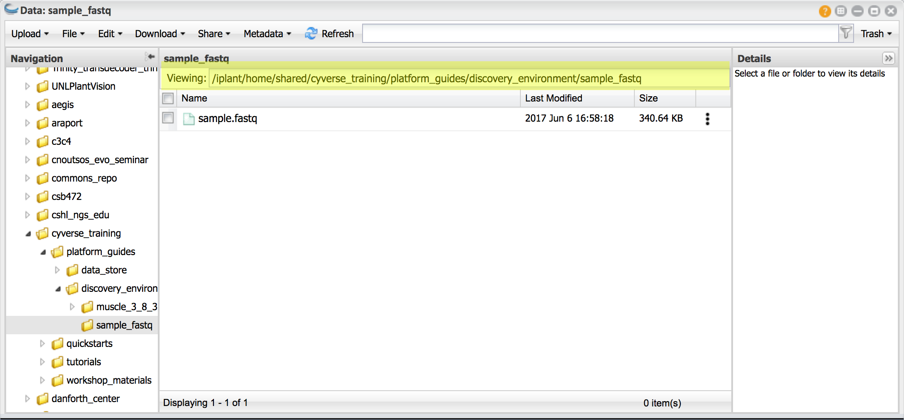

|CyVerse logo|_

|Home_Icon|_
`Learning Center Home <http://learning.cyverse.org/>`_

Viewing and manging data
------------------------

**Description:**

The Discovery Environment allows you to access, view, and manage your files in
the CyVerse Data Store. You can upload smaller files, but for large files or
large number of files, we recommend faster secure methods such as Cyberduck.

..
	#### Comment: short text description goes here ####

**Navigate the Data Window**

1. Click on the data icon |data_icon| to view files accessible to you in the
Data Store.

  .. Tip::
    The top directory in the data window is your username and is your
    your personal folder on the datastore.

    |data_window|

    The other directories include:

    - *Community Data*: Publically available data hosted on CyVerse
    - *Shared with me*: Data shared with you by CyVerse or individual CyVerse users
    - *Trash*: Data deleted in the Discovery Environment goes here
    - *Favorites*: Folder your have marked as favorite will be shown here

**Quick Exercises: Preview a file and metadata**

1. Click on **Data** to open the Data Window.

2. View a sample `fastq <https://en.wikipedia.org/wiki/FASTQ_format>`_ file; place the following path in the 'Viewing' feild of the data window:
  **"/iplant/home/shared/cyverse_training/platform_guides/discovery_enviornment/sample_fastq"** |viewing_window|.

3. Preview **sample.fastq** by clicking on the file name.

.. Tip::
  You can preview even large files (like fastq files) in the Discovery
  Environment. Large files will be viewed across several pages. Delimited files
  (tab, comma, etc.) will be formatted and are sortable.

4. Select **sample.fastq** and click on the *Metadata* menu and select *Edit/View Metadata*

..
	#### Comment: Suggested style guide:
	1. Steps begin with a verb or preposition: Click on... OR Under the "Results Menu"
	2. Locations of files listed parenthetically, separated by carets, ultimate object in bold
	(Username > analyses > *output*)
	3. Buttons and/or keywords in bold: Click on **Apps** OR select **Arabidopsis**
	4. Primary menu titles in double quotes: Under "Input" choose...
	5. Secondary menu titles or headers in single quotes: For the 'Select Input' option choose...
	####

Fix or improve this documentation
~~~~~~~~~~~~~~~~~~~~~~~~~~~~~~~~~

Fix this tutorial on GitHub:
    `GitHub <FIX_THIS_IN_YOUR_DOCUMENTATION>`_

Send a note:
    `Tutorials@CyVerse.org <Tutorials@CyVerse.org>`_

|Home_Icon|_
`Learning Center Home <http://learning.cyverse.org/>`_

.. |CyVerse logo| image:: ./img/cyverse_rgb.png
    :width: 500
    :height: 100
.. _CyVerse logo: http://learning.cyverse.org/
.. |Home_Icon| image:: ./img/homeicon.png
    :width: 25
    :height: 25
.. _Home_Icon: http://learning.cyverse.org/

