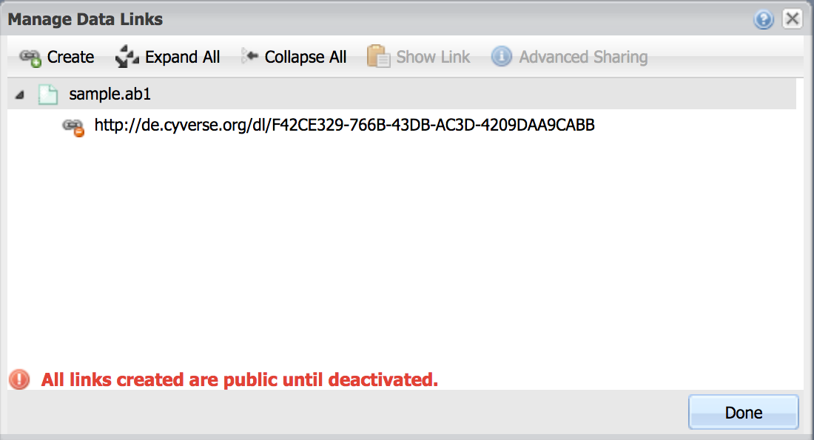
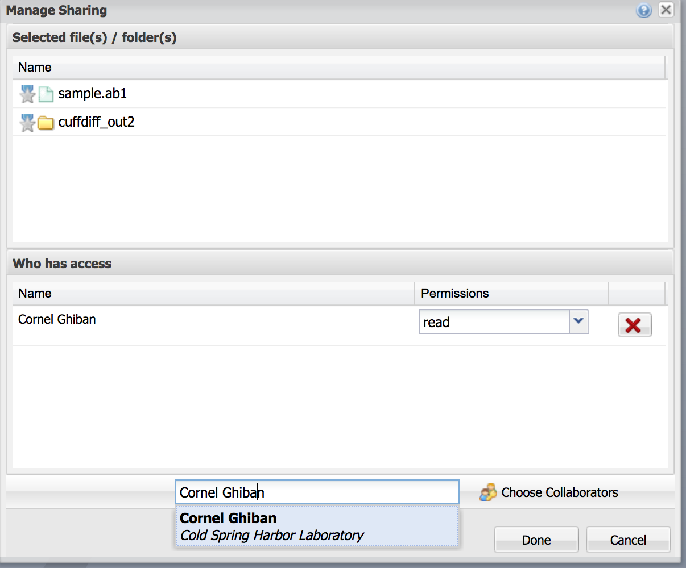

.. include:: cyverse_rst_defined_substitutions.txt
|CyVerse_logo|_

|Home_Icon|_
`Learning Center Home <http://learning.cyverse.org/>`_

Viewing and Managing Data
-------------------------

The Discovery Environment allows you to access, view, and manage your files in
the CyVerse Data Store. You can upload smaller files, but for large files or
large number of files, we recommend faster methods such as Cyberduck. See the
`Cyberduck page <https://cyverse-data-store-guide.readthedocs-hosted.com/en/latest/step1.html>`_ in our `Data Store Guide <https://cyverse-data-store-guide.readthedocs-hosted.com/en/latest/>`_ to get started with Cyberduck.

----

..
	#### Comment: short text description goes here ####

*Navigating the Data Window in the Discovery Environment*
~~~~~~~~~~~~~~~~~~~~~~~~~~~~~~~~~~~~~~~~~~~~~~~~~~~~~~~~~

1. If necessary, login to the |discovery environment|.

2. Click on the data icon |data_icon| to view files accessible to you in the
   Data Store.

  .. Tip::
    The first directory in the data window is your username and is your
    your personal folder on the Data Store.

    |data_window|

    The other directories include:

    - *Community Data*: publicly available data hosted on CyVerse
    - *Shared with me*: data shared with you by CyVerse or individual users
    - *Trash*: data deleted in the Discovery Environment goes here
    - *Favorites*: folder(s) your have marked as favorite will be shown here

----

*Preview a File and View Metadata in Discovery Environment*
~~~~~~~~~~~~~~~~~~~~~~~~~~~~~~~~~~~~~~~~~~~~~~~~~~~~~~~~~~~

In the DE you can preview many file types include images and plain- or
delimited-text files. The DE also allows you to associate your data with
metadata.

1. If necessary, login to the |discovery environment|.

2. Click on **Data** to open the Data Window.

3. View a sample fastq file; place the following path in the 'Viewing' field
   of the data window:

   **"/iplant/home/shared/cyverse_training/platform_guides/discovery_envirornment/sample_fastq"**

   |viewing_window|

4. Preview **sample.fastq** by clicking on the file name.

  .. Tip::
    You can preview even large files (like fastq files) in the Discovery
    Environment. Large files will be viewed across several pages. Delimited files
    (tab, comma, etc.) will be formatted and are sortable.

5. Select **sample.fastq** and click on the *Metadata* menu and select
   *Edit/View Metadata*

   .. Tip::
     You can apply one of several metadata templates to your datasets, or use your
     own. Applying metadata to your datasets makes them more easily searchable, and
     also prepares them for publication (e.g. to NCBI databases such as the Short
     Read Archive (SRA)).

----

*Share a File in Discovery Environment with a URL (Public Link)*
~~~~~~~~~~~~~~~~~~~~~~~~~~~~~~~~~~~~~~~~~~~~~~~~~~~~~~~~~~~~~~~~~
You can quickly share files in your Data Store using a Discovery Environment
Public Link.

.. Note::
  You can **only share individual files** using the quick link. Since files are
  shared over HTTP this is only recommended for small files. This is a convenient
  , but less secure method for file transfer. Do not share sensitive/private
  data using these links.

1. If necessary, login to the |discovery environment|.

2. In the Data window, select (checkbox) an individual file you wish to share.

3. From the *Share* menu, select *Create a Public Link*.

4. In the “Manage Data Links” window, select the file you wish to share, and
   click **Create**.

5. A new URL should appear beneath the file name. Click on this URL and the
   click on Copy in order to be presented with a window that will allow you to
   copy the URL to your clipboard. Anyone who you share this link with will be
   able to download the file. You can test the link in a new web browser window.

    |data_links_window|

6. Deactivate a data link by selecting the file; from the *Share* menu click via
   Public Link. Clicking the |delete_icon| delete icon, next to the links you
   wish to inactivate. Once you deactivate the link, anyone with whom you shared
   it with will no longer be able to access that data.

  .. Tip::
    You can quickly create a link to a file by clicking the |link_icon| link icon
    next to file you wish to share. Manage these links using the "Manage Data
    Links" console which is accessible from the *Share* menu as described above.

----

*Share a File/folder in Discovery Environment with Another CyVerse User*
~~~~~~~~~~~~~~~~~~~~~~~~~~~~~~~~~~~~~~~~~~~~~~~~~~~~~~~~~~~~~~~~~~~~~~~~~
Share data with another CyVerse user by granting permission to read, write, or
own files/folders

1. If necessary, login to the |discovery environment|.

2. In the Data window, select (checkbox) file(s), folder(s) you wish to share
   with another user;
   then under the *Share* menus select *Share with Collaborators...*
3. In the “Manage Sharing” menu, under ‘Selected File(s)/Folder(s) the name of
   the files and folders you are currently sharing are displayed. Ensure the
   file you wish to share now is selected.

    |manage_sharing|

4. In the ‘search for users’ field search for the CyVerse user you wish to share
   with by search for their name, or CyVerse username. You may also select
   ‘Choose from Collaborators’ which will bring up a list of people you have
   designated as collaborators.
5. Next, under ‘Permissions’ choose what permission you want to grant the person
   you are sharing this file with.
6. Once you are finished, click Done to begin sharing. The user will be notified
   that a file has been shared with them.

   .. hint::
      By managing access to data, the DE allows you to share large datasets
      instantaneously. Data permissions (based on UNIX permissions) are
      described in this chart:

      .. list-table::
          :header-rows: 1

          * - Permission level
            - Read
            - Download/Save
            - Metadata
            - Rename
            - Move
            - Delete
          * - Read
            - **X**
            - **X**
            - **View**
            -
            -
            -
          * - Write
            - **X**
            - **X**
            - **Add/Edit**
            -
            -
            -
          * - Own
            - **X**
            - **X**
            - **Add/Edit**
            - **X**
            - **X**
            - **X**

..
	#### Comment: Suggested style guide:
	1. Steps begin with a verb or preposition: Click on... OR Under the "Results Menu"
	2. Locations of files listed parenthetically, separated by carets, ultimate object in bold
	(Username > analyses > *output*)
	3. Buttons and/or keywords in bold: Click on **Apps** OR select **Arabidopsis**
	4. Primary menu titles in double quotes: Under "Input" choose...
	5. Secondary menu titles or headers in single quotes: For the 'Select Input' option choose...
	####

----

**Fix or improve this documentation**

- Search for an answer:
  |CyVerse Learning Center|
- Ask us for help:
  click |Intercom| on the lower right-hand side of the page
- Report an issue or submit a change:
  |Github Repo Link|
- Send feedback: `Tutorials@CyVerse.org <Tutorials@CyVerse.org>`_

----

.. |CyVerse logo| image:: ./img/cyverse_rgb.png
    :width: 500
    :height: 100
.. _CyVerse logo: http://learning.cyverse.org/
.. |Home_Icon| image:: ./img/homeicon.png
    :width: 25
    :height: 25
.. _Home_Icon: http://learning.cyverse.org/
.. |data_icon| image:: ./img/de/data_icon.png
    :width: 30
    :height: 30
.. |data_window| image:: ./img/de/data_window.png
    :width: 550
    :height: 300
.. |viewing_window| image:: ./img/de/viewing_window.png
    :width: 400
    :height: 200

.. |discovery environment| raw:: html

    <a href="https://de.cyverse.org/de/" target="_blank">https://de.cyverse.org/de/</a>
