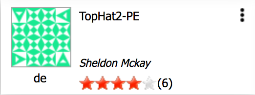
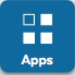
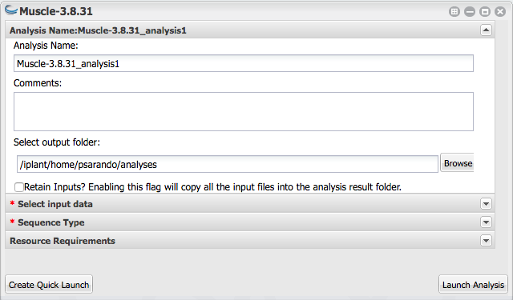

|CyVerse logo|_

|Home_Icon|_
`Learning Center Home <http://learning.cyverse.org/>`_

Launching an analysis job
-------------------------

**Description:**

When you are ready to analyze data, you can select from one of several hundred
applications in the Discovery Environment. We will cover the minimum you need to
launch an analysis using some sample data. In this example, we will use the **Muscle**
multiple sequence aligner app, to align some DNA sequences.

..
	#### Comment: short text description goes here ####

**Example Data**

.. list-table::
    :header-rows: 1

    * - Input
      - Description
      - Example
    * - Unaligned DNA sequence reads
      - One or more sequences in FASTA format
      - `DE_sample_plants.fas <http://datacommons.cyverse.org/browse/iplant/home/shared/cyverse_training/platform_guides/discovery_enviornment/muscle_3_8_31/01_muscle_input/DE_sample_plants.fas>`_

**Discovery Environment App(s):**

.. list-table::
    :header-rows: 1

    * - App name
      - Version
      - Description
      - App link
      - Notes/other links
    * - Muscle
      - 3.8.31
      - Multiple sequence aligner
      -	`DE App link <https://de.cyverse.org/de/?type=apps&app-id=9b41c9e4-5031-4a49-b1cb-c471335df16e&system-id=de>`_
      -

.. Tip::
    Applications in the Discovery Enviorment **Apps** menu have several features:
    |de_app_icon|

    - |info| **Info**: Information about the App including short description.
      user manual, number of successful analyses, date of last use, URL link to
      App
    - |comment| **Comment**: Add comments/feedback on the App
    - |favorite| **Favorite**: Add to your list of favorite Apps
    - |rating| **Rating**: Rate the app, and see current community rating (may
      indicate how many others liked the App)
    - |unavailable| **Unavailable**: App is disabled; may be outdated, unavailable
      due to maintanance. Contact support@cyverse.org for help using these
    - |beta| **Beta**: App is in beta testing (leave feedback if you use!)
    - |private| **Private**: Application is not public and not visiable by all users

**Example Discovery Environment analysis: Multiple sequence alignment with MUSCLE:**
~~~~~~~~~~~~~~~~~~~~~~~~~~~~~~~~~~~~~~~~~~~~~~~~~~~~~~~~~~~~~~~~~~~~~~~~~~~~~~~~~~~~
1. If necessary, login to the `Discovery Environment <https://de.cyverse.org/de/>`_

2. Click |apps_icon| **Apps** from the DE workspace; search for MUSCLE 3.8.31 or
   click this link to `Muscle 3.8.31 <https://de.cyverse.org/de/?type=apps&app-id=9b41c9e4-5031-4a49-b1cb-c471335df16e&system-id=de>`_

3. Under “Analysis Name” leave the defaults or make any desired notes.
   |muscle_app_window|
4. Under “Select Input data” click **Browse**, then navigate to and select
   `DE_sample_plants.fas <https://de.cyverse.org/de/?type=data&folder=/iplant/home/shared/cyverse_training/platform_guides/discovery_enviornment/muscle_input>`_; then click OK.

   (Location: *Community Data > cyverse_training > platform_guides > discovery_environment > muscle_3_8_31 > 01_muscle_input*)

5. Under “Sequence Type”, select **DNA**, and then click **Launch Analysis**. You will receive a notification and may close the Apps window.

----

Fix or improve this documentation
~~~~~~~~~~~~~~~~~~~~~~~~~~~~~~~~~

Fix this tutorial on GitHub:
    `GitHub <https://github.com/CyVerse-learning-materials/discovery_environment_guide>`_

Send a note:
    `Tutorials@CyVerse.org <Tutorials@CyVerse.org>`_

|Home_Icon|_
`Learning Center Home <http://learning.cyverse.org/>`_

.. |CyVerse logo| image:: ./img/cyverse_rgb.png
    :width: 500
    :height: 100
.. _CyVerse logo: http://learning.cyverse.org/
.. |Home_Icon| image:: ./img/homeicon.png
    :width: 15
    :height: 15
.. _Home_Icon: http://learning.cyverse.org/

